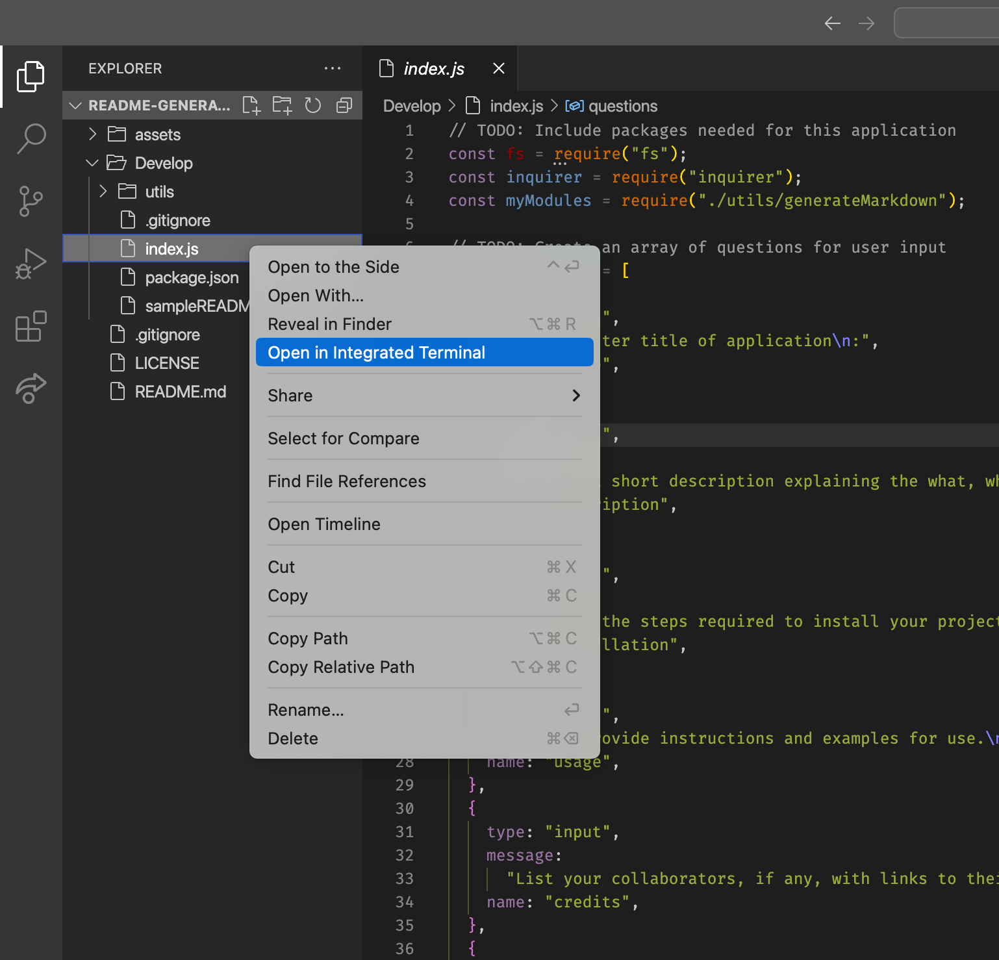
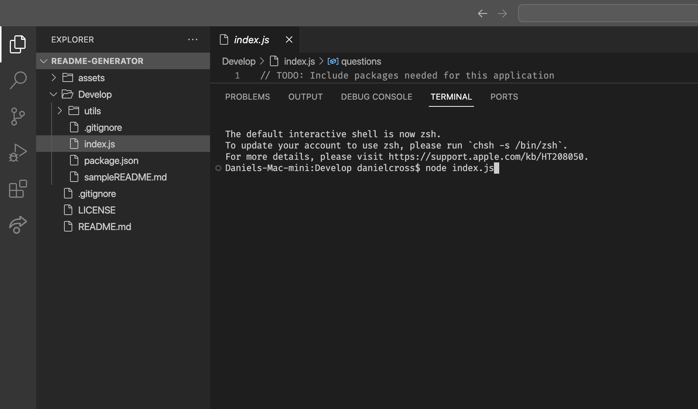
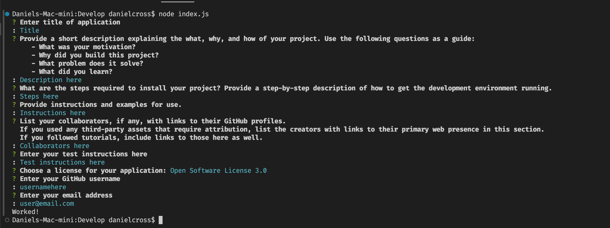
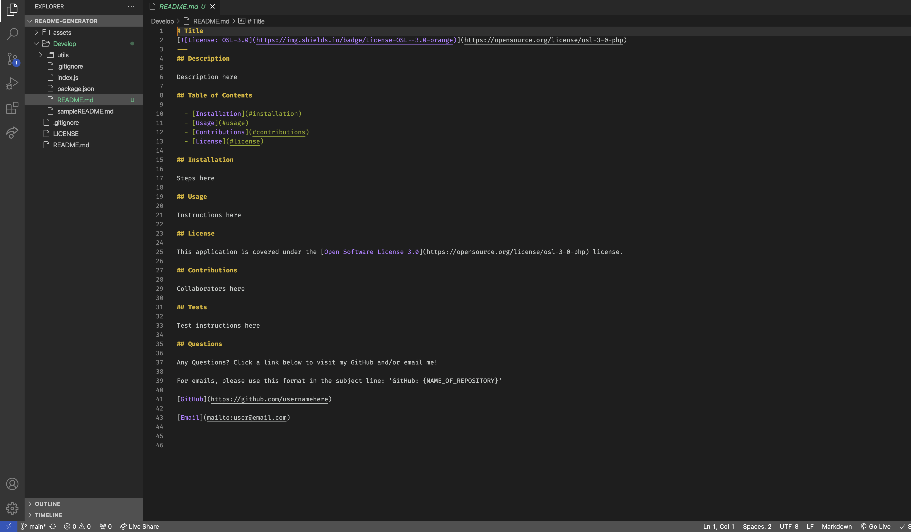
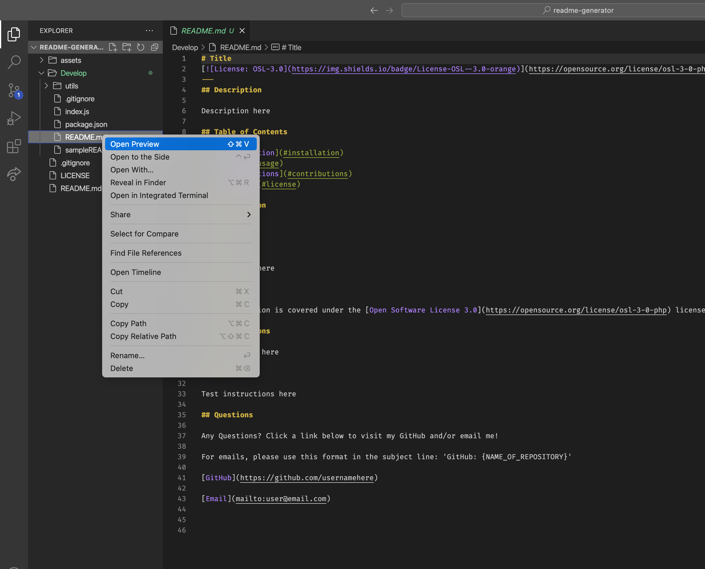
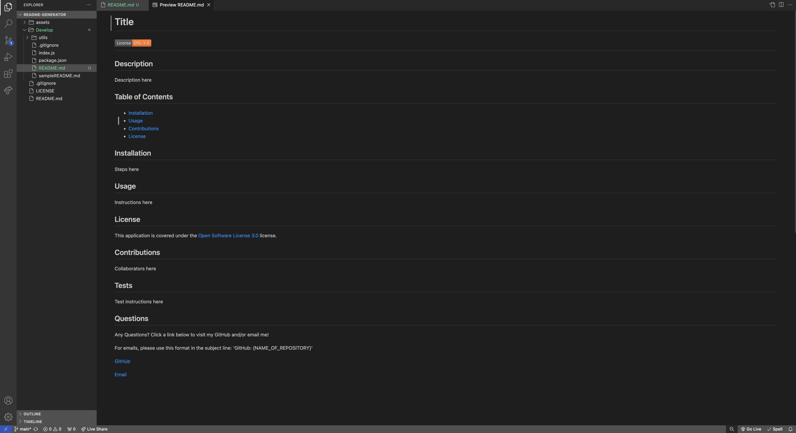

# README Generator

## 

## Description

The goal of this application is to make the process of creating a professional README.md file more simple and efficient. Rather than creating a README file from scratch, or even copying a README template and filling in the contents, the user can be ushered through a series of prompts, providing the necessary content to fill out the README. It takes the simplicity of a template one step further.

The final README.md file generated will appear in the 'Develop' directory included in this repository. It will include the following:

### SECTIONS:

- Title
- Description
- Table of Contents
- Installation
- Usage
- Credits
- License
- Tests
- Questions

### FEATURES:

- Badge displayed at top, indicated license used, with a working link to a site for that license (additional link in 'License' section)
- Working table of contents links
- Links in the 'Questions' section to user's GitHub page and email (opens email application with a new email addressed to user)

---

Through the process of developing this simple app, I familiarized myself with the use of the following new topics:

### TECHNOLOGIES:

- Node.js
- npm
- Inquirer.js
- fs
- QuickTime screen recording (NOTE: It was recommended that the Google Chrome extension 'Screencastify' be used; I used MacOS's free QuickTime screen recording function, however, as it is free to use and equally functional.)

### SKILLS:

- Inquirer's 'prompt' method
- npm and node command-line syntax
- npm's 'require' method
- Modularization; exporting/importing custom module file
- Template literals: to import user inputs into a README template

## Table of Contents

- [Installation](#installation)
- [Usage](#usage)
- [Credits](#credits)
- [License](#license)

## Installation

1. In your terminal, navigate to the directory in which you would like the clone the repository
2. In the command-line, type 'git clone git@github.com:danrcross/readme-generator.git'
3. Type 'cd readme-generator' to change into the directory of the app.
4. Type 'code .' to open the repository in VSCode
5. The app is ready to use! Follow the usage instructions below!

## Usage

Click on the link below to see a quick video walkthrough of how the application should function (will open in browser window):
[Video Walkthrough](https://drive.google.com/file/d/1iW5tIrfA-0zY1QCWHcxbDJVP1aWd_zO8/view?usp=sharing)

Additionally, here are some screenshots highlighting the important steps of using the app properly:

1. Right click on the index.js file; select 'Open in Integrated Terminal':
   
2. Type 'node index.js' to run the application:
   
3. Answer the prompts according to what they request. Once complete, your log should look something like this:
   
4. The README.md file generated should then appear in the 'Develop' folder; click once to open it:
   
5. Right-click on the README.md file and select 'Open Preview' to see the file in its materialized Markdown format:
   
6. The preview should look something like this; note the slick-looking badge at the top!
   

## Credits

Most skills used in this project were learned through course instruction and materials.

This project was developed from starter code, obtained here:
[potential-enigma](https://github.com/coding-boot-camp/potential-enigma)

For this code, credits to these GitHub users:

- [coding-boot-camp](https://github.com/coding-boot-camp)
- [Xandromus](https://github.com/Xandromus)
- [gachoi06](https://github.com/gachoi06)

Apple support page for using MacOS screen recording feature:
[How to record the screen on your Mac](https://support.apple.com/en-us/102618)

Markdown Cheat Sheet for additional Markdown syntax help:
[Markdown Cheat Sheet](https://www.markdownguide.org/cheat-sheet/)

## License

This application is covered under the [MIT](https://opensource.org/licenses/MIT) license.

## Tests

No tests were used/developed for this application.

## Questions

Any Questions? Visit my GitHub! Email me!

[GitHub](https://github.com/danrcross)

Email: [mailto:danrcross@gmail.com](mailto:danrcross@gmail.com)
